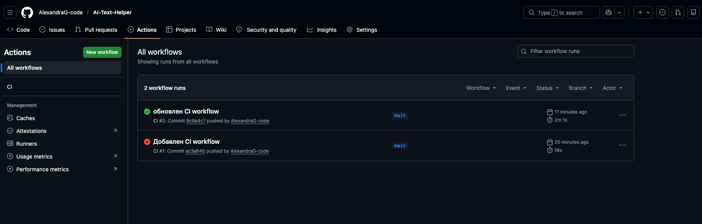
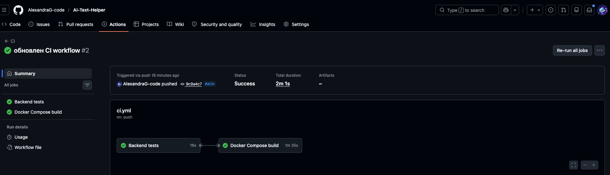
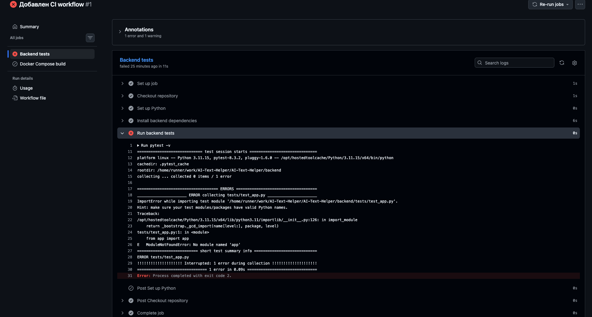

# Practice106 — Continuous Integration 

## Описание проекта

Для выполнения работы использовался проект **AI Text Helper**.

AI Text Helper — это микросервисное веб-приложение для обработки и улучшения текста. Пользователь вводит текст, выбирает режим обработки, после чего приложение создаёт задачу. Длительная обработка выполняется отдельным worker-сервисом, а backend только принимает запросы и управляет статусами задач.

Проект состоит из нескольких сервисов:

- `frontend` — пользовательский интерфейс;
- `backend` — WSGI API на Flask;
- `worker` — сервис для выполнения длительных AI/NLP-задач;
- `redis` — очередь задач и временное хранилище результатов;
- `nginx` — единая внешняя точка входа.

Проект запускается с помощью Docker Compose.

## Ссылка на репозиторий проекта

Репозиторий проекта с исходным кодом:

```text
https://github.com/AlexandraG-code/AI-Text-Helper
```
 

## Цель работы

Цель работы — настроить процесс Continuous Integration для автоматического тестирования входящих изменений при pull request в главную ветку репозитория.

## Используемая CI/CD платформа

Для настройки CI использовался инструмент **GitHub Actions**.

Workflow расположен в основном репозитории проекта по пути:

```text
.github/workflows/ci.yml
```

## Описание workflow

CI pipeline автоматически запускается:

- при создании pull request в ветку `main`;
- при push в ветку `main`.

Workflow выполняет следующие шаги:

1. Загружает код репозитория.
2. Устанавливает Python.
3. Устанавливает зависимости backend.
4. Запускает тесты backend через `pytest`.
5. Выполняет сборку проекта через Docker Compose.

## Проверяемые части проекта

В рамках CI проверяется backend-часть приложения.

Тесты проверяют:

- доступность endpoint `/api/health`;
- получение списка режимов обработки текста;
- обработку ошибки при пустом тексте;
- обработку ошибки при неверном режиме обработки.

Тесты находятся в проекте по пути:

```text
backend/tests/test_app.py
```

## Пример запуска тестов локально

Для локального запуска тестов необходимо перейти в папку backend, установить зависимости и запустить pytest:

```bash
cd backend
pip install -r requirements.txt
pytest -v
```

## Пример запуска проекта локально

В корне проекта выполнить команду:

```bash
docker compose up --build
```

После запуска приложение доступно по адресу:

```text
http://localhost
```

Проверить backend можно командой:

```bash
curl http://localhost/api/health
```

Ожидаемый ответ:

```json
{
  "service": "backend",
  "status": "ok"
}
```

## Демонстрация успешного выполнения CI

Был выполнен успешный запуск GitHub Actions. Pipeline последовательно установил зависимости, запустил тесты и выполнил сборку проекта.



Скриншот успешного выполнения:



## Демонстрация выполнения CI с ошибкой

Для демонстрации ошибки один из тестов был временно изменён так, чтобы ожидать неверное значение. После push GitHub Actions автоматически запустил pipeline, и выполнение завершилось с ошибкой.

Скриншот выполнения с ошибкой:



## Вывод

В ходе работы был настроен CI-процесс с использованием GitHub Actions. Workflow автоматически запускается при pull request в главную ветку, устанавливает зависимости проекта, запускает тесты и проверяет сборку приложения.

Также была продемонстрирована ситуация успешного выполнения pipeline и ситуация завершения pipeline с ошибкой.

## Выполнила:Ермолинская АА, РИМ-150975к
