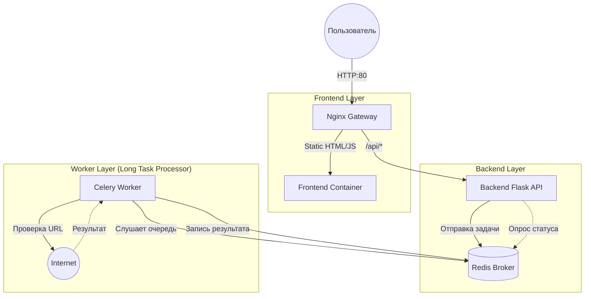

# 🌐 URL Checker (Microservices Project)

[](https://github.com/gornyhivan01/1055)

Сервис для проверки доступности веб-сайтов, построенный на микросервисной архитектуре с использованием Docker.

## 🏗 Архитектура системы

Проект разделен на независимые слои для обеспечения отказоустойчивости и возможности масштабирования.



## 🛠 Технологический стек
- Gateway: Nginx (Reverse Proxy)
- Frontend: HTML5 / JavaScript (Vanilla) / Nginx
- Backend: Python 3.11 / Flask / Gunicorn (WSGI)
- Task Queue: Celery + Redis
- Worker: Python 3.11 / Requests
- Orchestration: Docker Compose

## 🚀 Быстрый запуск
Все компоненты запускаются одной командой из корневой директории `GornyhIS`

```bash
docker compose up --build
```

После запуска приложение доступно по адресу: 
```text
http://localhost
```

## 📂 Структура проекта
```text
/backend — API для приема заявок и отдачи статуса задач.
/worker — Сервис, выполняющий реальные HTTP-запросы.
/frontend — Простой UI для взаимодействия с пользователем.
nginx.conf — Правила маршрутизации трафика.
docker-compose.yml — Описание связи всех контейнеров.
```
## ✨ Особенности реализации
- **Выбор протокола**: пользователь выбирает `http://` или `https://` через выпадающий список.
- **Определение IP**: при проверке сайта автоматически определяется IP-адрес сервера через DNS.
- **Отображение результата**: на экран выводится:
  - Статус доступности (✅/❌)
  - HTTP-статус код
  - IP-адрес целевого сервера
- **Асинхронная обработка**:
  - Задача отправляется в очередь через Redis
  - Backend сразу возвращает `task_id`
  - Frontend опрашивает статус через polling

## 📝 Как это работает
1. Пользователь выбирает протокол (`http` или `https`) и вводит домен (например, `google.com`).
2. Frontend формирует полный URL и отправляет POST-запрос на `/api/check`.
3. Backend создаёт задачу в Celery, возвращает `task_id`.
4. Celery Worker забирает задачу, определяет IP-адрес, делает HTTP-запрос.
5. Результат сохраняется в Redis.
6. Frontend периодически опрашивает `/api/status/<task_id>`, пока не получит результат.
7. Отображается статус, код ответа и IP-адрес.

## ✅ Тестирование
Юнит-тесты Worker:
```bash 
cd worker 
python -m pytest test_tasks.py -v --cov=tasks --cov-report=term
```

Тесты проверяют:
- Успешный ответ с IP
- Ошибку DNS (неизвестный хост)
- Ошибку подключения (таймаут, отказ соединения)

Юнит-тесты Backend:
```bash 
cd backend 
python -m pytest test_app.py -v
```
- Он проверяет корректность HTTP-маршрутов и взаимодействие с Celery
- не запускает реальных задач

---

Проект полностью рабочий, модульный и готов к демонстрации 💯

## 🔄 Автоматическое тестирование (CI/CD)

При каждом изменении кода и создании **Pull Request в ветку `main`** запускается автоматическое тестирование с помощью **GitHub Actions**.

### 📦 Что проверяется
- ✅ Запуск юнит-тестов для `worker` и `backend`
- ✅ Проверка покрытия кода тестами
- ✅ Установка зависимостей из `requirements.txt`
- ✅ Контроль качества: если покрытие < 80% — тесты падают

### 🛠 Конфигурация
Файл: `.github/workflows/test.yml`

```yaml
name: Run Backend and Worker Tests

on:
  pull_request:
    branches: [ main ]

jobs:
  test:
    runs-on: ubuntu-latest
    strategy:
      matrix:
        component:
          - name: Worker
            path: worker
            requirements: worker/requirements.txt
            test: test_tasks.py
            cov: tasks
          - name: Backend
            path: backend
            requirements: backend/requirements.txt
            test: test_app.py
            cov: backend

    steps:
      - name: Checkout code
        uses: actions/checkout@v3

      - name: Set up Python 3.9
        uses: actions/setup-python@v4
        with:
          python-version: '3.9'

      - name: Install dependencies
        run: |
          python -m pip install --upgrade pip
          pip install pytest pytest-cov
          pip install -r ${{ matrix.component.requirements }}

      - name: Run tests
        run: |
          cd ${{ matrix.component.path }} && \
          PYTHONPATH=. python -m pytest ${{ matrix.component.test }} -v \
            --cov=${{ matrix.component.cov }} \
            --cov-report=term \
            --cov-fail-under=80


#
