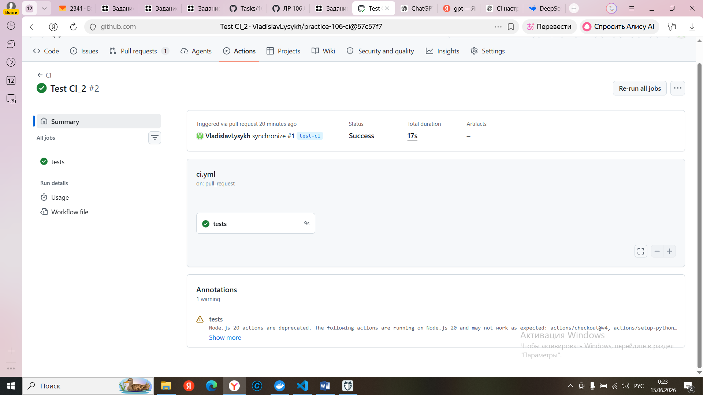
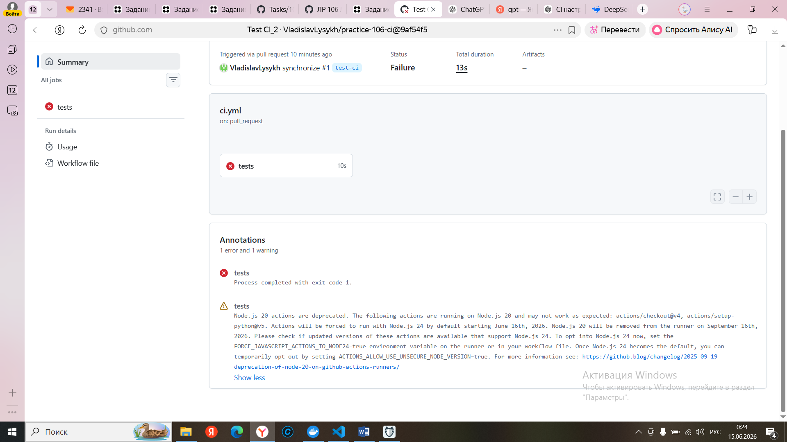

# Лабораторная работа №106. Continuous Integration (CI)

# Лысых Владсилав Антонович, РИМ-150975к

## Цель работы

Настроить автоматический запуск тестов проекта при создании Pull Request в основную ветку репозитория.

## Описание проекта

В качестве проекта используется веб-приложение на Python.

Исходный код проекта размещён в отдельном репозитории:

https://github.com/VladislavLysykh/practice-106-ci

Проект содержит backend-компонент и набор автоматических тестов, запускаемых с помощью pytest.

## Используемый инструмент CI/CD

GitHub Actions.

Файл workflow:

.github/workflows/ci.yml

## Настроенный workflow

Workflow запускается автоматически при Pull Request в ветку main.

Этапы выполнения:

1. Checkout repository
2. Установка Python 3.13
3. Установка зависимостей из requirements.txt
4. Запуск тестов pytest

## Результаты

Было проверено:

* автоматический запуск workflow при Pull Request;
* успешное выполнение тестов;
* завершение workflow с ошибкой при намеренно сломанном тесте.

## Ссылка на проект

https://github.com/VladislavLysykh/practice-106-ci

## Скриншоты

В отчёт приложены:

1. Скриншот успешного выполнения CI.
2. Скриншот выполнения с ошибкой.

## Скриншоты

### Успешное выполнение CI

### Выполнение с ошибкой

